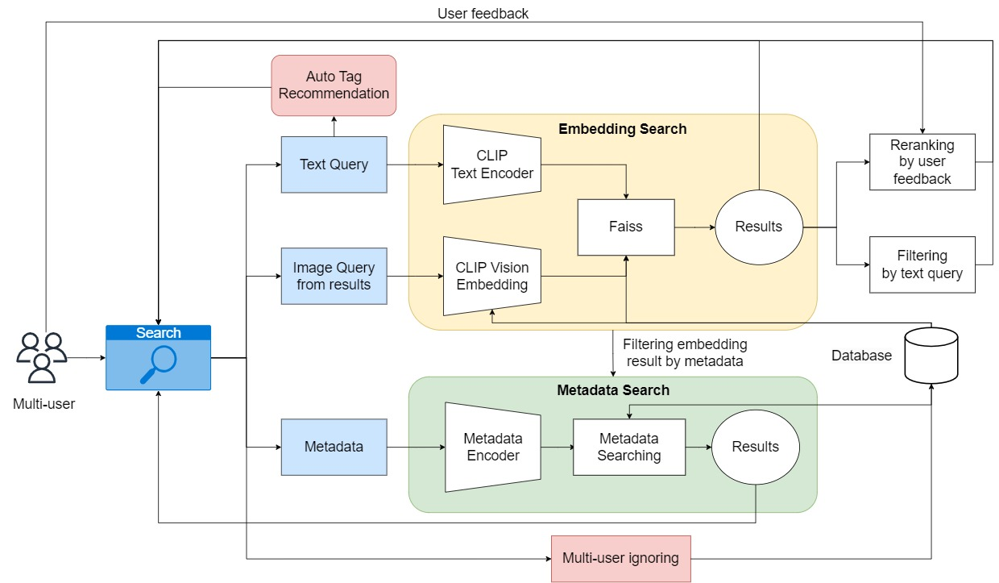
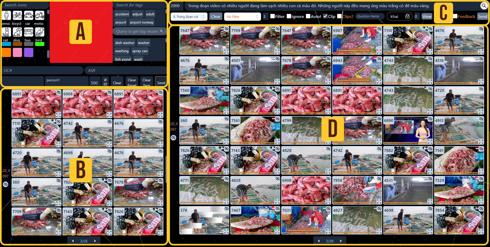

# Multi-User Video Retrieval: Bridging the Gap Between Text and Embedding Queries


## Pipeline


## Dataset preparation
Dataset structure:
```
|- dict 
   |- ...
   |- faiss_clip_cosine.bin
   |- faiss_clipv2_cosine.bin
|- frontend
   |- ai
   |   |- public
   |   |   |- data
   |   |   |   |- KeyFrames
   |   |   |   |   |-L01
   |   |   |   |   |-L01_extra
   |   |   |   |   |-....
```

### Dict
Download dict zip file: [dict](https://drive.google.com/file/d/1QbLLyBb60JD-dhdN9aIYnULFf8mchLVX/view?usp=sharing)


## Dataset extraction
Detailed on dataset extraction: [data](dataset_extraction/README.md)

## Installation
- ### Backend
```
conda create -n AIChallenge2023
conda activate AIChallenge2023
pip install git+https://github.com/openai/CLIP.git
pip install -r requirements.txt
```

- ### Frontend
Install nodejs: https://nodejs.org/en/download
```
npm install

npm install next react react-dom

```

- ### DB Sever
```
pip install flask
pip install flask-cors
pip install flask-socketio
pip install pyngrok==4.1.1
ngrok authtoken your_token # Add your ngrok authentication
```

## Usage
It is recommended to configure the environment using Anaconda. Linux support only.

- ### Backend
Using local machine, from root of repo:
```
python app.py
```
Using colaboratory, run appNotebook (App section) for starting the backend.

- ### Frontend
Change url in frontend/ai/src/helper/web_url.js. 
```
cd frontend/ai/
npm run dev
```

- ### DB Sever
Open 2 terminal and run:
```
python appStorage.py
```
```
ngrok http 5000
```

- ### Interface



